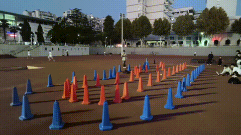

# 🏁 OUTDOOR_RACE -- SMART_CAR_RACE

This project was developed for the **19th SMART CAR RACE – Outdoor Category**.

> ⚠️ **Note**: The complete source code is not fully provided due to supplier confidentiality. We only modified the encoder and IMU modules. The included `.zip` file contains our competition-specific implementation, reflecting our contributions.

---

## 📦 Project Overview

This autonomous driving project integrates all key modules into a single Python script due to CPU resource constraints that prevented effective multiprocessing across files.

### 🔧 Features Included:
- 🧭 SLAM: GMapping-based mapping and localization
- 🛣️ Path Planning: Custom implementation
- 🚗 Vehicle Control: Stanley Controller
- 📡 Radar Data Processing: Real-time obstacle awareness
- 🎯 Computer Vision: Object detection using YOLOv5
- 🔄 Framework: Built entirely on ROS

---

## 🏆 Competition Results

The car completed all tasks successfully on the competition track and achieved:

- ✅ **Official Run Time**: 37 seconds  
- 🚀 **Max Test Speed**: 35 seconds (limited by SLAM stability)  
- 📊 **Rank**: Top 10 nationally in the final round

---

## 📁 Contents

- `competition_code.zip`: Packaged codebase used during the final competition
- `README.md`: Project description and structure

---

## 📸 Demo & Results

> 🔗 *For more project insights, contact us or check the logs inside the zip.*

